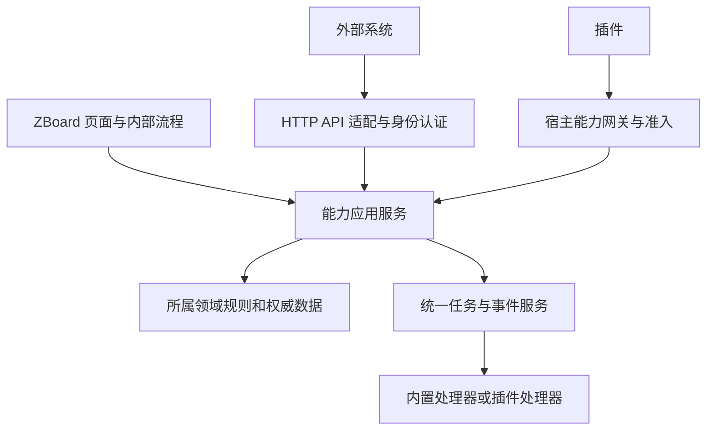

# ZBoard 能力架构重划与迁移计划

状态：规划稿，2026-09-12。依据当前 `codex/runtime-jobs` 工作树（基线 86d29a1，含未提交实现）及本地插件开发、治理文档。本文定义目标，不代表接口已经发布或迁移完成。

## 1. 目标与现状

ZBoard 拥有核心能力、权威数据和主体业务实现。可替换的渠道、供应商、策略和可选扩展流程通过插件提供。内部模块、插件、外部系统复用同一应用能力；入口的身份、权限与传输不同，业务规则不能复制。

此次重划覆盖整个产品，而非只重写任务队列。保持单体部署，先按能力形成模块边界；模块不是微服务，也不意味着每个能力都必须远程调用。

已核实的问题：

- `backend/internal/handler/handlers.go` 为 7,484 行，包含认证、业务状态、数据库访问与外部执行；拆出同包文件没有形成权限或数据所有权边界。
- `backend/internal/server/router.go` 同时注册各领域 HTTP 路由和启动后台工作。
- `background_jobs.go`、`admin_task_worker.go`、`node_publish_worker.go`、`plugins/tasks_runtime.go` 各有调度或执行预算；`jobrun/registry.go` 只是内存观测，不能代表全局任务服务。
- `zero_event_runtime.go` 有独立事件持久化缓冲和消费状态，不能直接删除后改为易丢失的内存任务。
- `plugins/manifest.go` 白名单目前覆盖页面、配置、身份、私有存储及本地新增的任务声明；`pkg/pluginapi/v1/control.proto` 主要是宿主调用插件，尚无完整的宿主业务能力入口。
- 现有模型包含 User、Order、Subscription、ProtocolCredential、TrafficRecord、Node、ProviderAccount、Task 等。权威状态目前集中在共享模型及 handler，插件化不能将同一状态再复制给插件管理。

本轮为源代码结构和契约盘点，不是全量函数语义审计、生产容量测试或在线发布验收。逐项迁移前仍需验证对应事务和外部副作用。

## 2. 能力地图

下表是首版完整产品板块划分。入口名为拟议的能力标识，非当前可调用 API。核心所有权是状态及不变量的归属；插件可以调用已开放操作，但不能越过该所有权直接改表。

| 板块 | 子能力 | 核心职责 | 插件职责 | 入口示例 |
|---|---|---|---|---|
| 身份与访问 identity | 账户、登录会话、身份绑定、API 身份、权限 | 用户状态、凭据、会话签发、资源授权、身份关联规则 | OAuth 等外部身份提供方 | identity.accounts.get / identity.bindings.create |
| 平台治理 platform | 安装、配置、秘密值、维护、版本、数据库迁移 | 系统生命周期、配置 revision、秘密引用、维护协调 | 自身配置定义与检查，不接管系统迁移 | platform.settings.get / platform.maintenance.enter |
| 扩展管理 extensions | 安装、准入、生命周期、能力协商、私有数据、页面 | 签名校验、版本切换、实例撤销、命名空间和 UI 容器 | 声明需求、提供处理器及页面 | extensions.installations.get / extensions.storage.put |
| 任务执行 jobs | 定义、周期、投递、领取、尝试、取消、恢复 | 全局持久化状态、调度权、并发配额、超时、重试与历史 | 注册任务处理器，提交自身获准的工作 | jobs.submit / jobs.schedules.upsert / jobs.runs.get |
| 事件与投递 events | 接收、去重、订阅、可靠投递、重放 | 事件信封、Inbox/Outbox、提交与确认边界 | 产生合法事件或订阅已开放事件 | events.publish / events.subscriptions.create |
| 资源与交付 resources | 节点、服务端点、分组、网络入口、配置发布、运维 | 资源身份、目标配置版本、部署状态、凭据归属、删除协调 | 云厂商、远程执行和新增内核适配器 | resources.nodes.get / resources.deployments.request |
| 网络资料 network | DNS 记录、证书、代理池、规则集、订阅格式 | 资源声明、版本、引用关系、校验、原子替换 | DNS/CA 供应商、订阅格式和规则源适配 | network.certificates.renew / network.pools.sync |
| 商品与订单 commerce | 商品、SKU、订单、支付事实、履约 | 价格快照、合法状态转换、支付幂等、履约一致性 | 支付渠道、促销扩展和第三方订单接入 | commerce.orders.create / commerce.payments.record |
| 权益与订阅 entitlements | 订阅、成员、配额、有效期、凭证、交付令牌 | 权益生效与失效、扣减、撤销、授权范围 | 订阅交付格式、可选权益策略 | entitlements.grants.adjust / entitlements.access.get |
| 计量与控制 metering | 事件入账、流量统计、对账、公平使用 | 原始计量、去重扣减、账实关系、限额执行 | 可选分析与公平使用决策策略 | metering.usage.query / metering.reconciliation.get |
| 消息与运营 messaging | 模板、消息请求、投递结果、运营批次 | 通用消息模型、收件范围、偏好、投递审计 | SMTP/其他渠道、活动编排 | messaging.deliveries.request / messaging.templates.render |
| 内容与服务 experience | 公告、工单、站点内容、用户入口 | 页面容器、通用导航和上下文；迁移期保留现有业务 | 公告、客服工单等可选应用及其领域数据 | 插件自有版本化契约，经宿主网关准入 |
| 可观测性 observability | 审计、操作记录、诊断、指标、执行关联 | 统一关联 ID、脱敏、查询、保留策略 | 自身结构化记录与诊断贡献 | observability.operations.get / observability.audit.query |

边界决策：

1. 订单、权益、计量、资源交付属于 ZBoard 主体，不因插件化而外包权威状态。支付插件提供核验后的支付事实，核心决定订单是否允许结算。
2. Zero 当前是主体交付实现，先放进明确的资源适配层，保持产品基本闭环；新增内核和供应商走插件扩展点，不在通用资源服务里增加供应商分支。
3. 证书/DNS 生命周期与引用归核心，供应商请求和验证适配归插件。不能把供应商选择和资源生命周期混成一个模块。
4. 公告、工单等可选业务规划迁出核心；通用消息请求能力保留。其数据迁移、卸载保留和前台路由是独立交付项，不随目录移动自动完成。
5. 公平使用的通用限额执行留核心，策略可替换。插件不能自行改配额账本或直接下发节点配置绕过交付版本检查。
6. 身份、安装、配置等最低运行闭环不能依赖可选插件启动成功。部署密钥、迁移、秘密明文不作为普通外部能力公开。

## 3. 模块内部结构与依赖

建议目标目录（按迁移逐步引入）：

```text
backend/internal/
  application/          # 组合根：依赖装配、启动和关闭
  capabilities/
    identity/           # 每个板块独立 application/domain/ports
    jobs/
    resources/
    commerce/
    ...
  adapters/
    http/               # 现有路由与外部版本化 API 适配
    plugin/             # 插件调用宿主、宿主调用插件的协议适配
    persistence/        # 各能力拥有的数据库实现
    zero/               # 当前主体内核适配
  platform/             # 时钟、日志、数据库连接等低层设施
backend/pkg/
  capabilityapi/v1/     # 开放契约 DTO、错误与客户端；不暴露 ORM
  pluginapi/v1/         # 插件生命周期和扩展处理器契约
```

子能力先作为领域内服务和明确操作，不机械地每项再建 package。领域规则不导入 HTTP、插件 SDK 或其他领域的 ORM。跨领域通过窄接口；只读聚合可用专属查询投影，不能以报表需求开放跨域写表。

HTTP handler 只负责解析、身份上下文、调用和响应映射。授权在应用能力入口再次执行，内部调用也必须提供真实的 system/user/plugin/integration 身份，禁止默认管理员上下文。

一次业务不变量涉及多个现有表时，先保持当前原子事务，把事务边界封装为拥有者的操作，再拆物理存储；不先拆表制造部分成功。跨域异步工作使用同事务 Outbox 和幂等消费。通用事务工具不意味着任何模块可任意改其他领域表。

## 4. 对内部、插件与外部开放的契约



统一入口指统一应用契约和实现，不要求内部回环 HTTP，也不提供一个任意方法名/任意 JSON 的万能执行接口。每个开放操作明确输入输出、权限、资源范围、幂等和失败语义。

每个能力契约必须登记：名称和版本、所有者、命令/查询/事件/提供方类别、调用身份、输入输出 schema、数据敏感级别、资源授权、幂等策略、同步或异步、超时、配额、错误码、兼容窗口及弃用条件。能力目录仅返回当前调用者可见的契约。

- 用户调用沿用用户权限；后台任务使用受限系统主体；插件使用绑定安装及 generation 的主体；外部集成使用可撤销、可限范围的独立凭据。不能复用管理员 token。
- 插件请求权限沿用签名声明和宿主准入。是否允许执行由声明、准入、实例状态、调用主体与资源策略共同决定；不增加逐项人工勾选才能运行的流程。
- 命令提交外部副作用时返回 operation_id/run_id；已入队、已接受、远端已完成是不同状态。查询返回稳定 DTO 和游标，不能返回 GORM 对象或无限列表。
- 统一错误分类：invalid_argument、unauthenticated、permission_denied、not_found、conflict、rate_limited、unavailable、deadline_exceeded；声明是否可重试，敏感底层错误只进入脱敏诊断。
- 事件带 event_id、schema_version、发生时间、来源、关联 ID；消费者按 event_id 去重，重放须保留原始业务幂等身份。
- 提供方接口单独定义，例如 PaymentProvider、DNSProvider、IdentityProvider。插件提供事实或结果，核心验证并提交状态转换。
- 版本按能力契约独立演进；manifest 能力需求须协商，不把“宿主版本号相同”当作协议兼容。旧 HTTP 路由先适配新服务，迁移期不直接删除。

原生插件目前不是操作系统沙箱。能力入口可以约束合法集成路径，但不能宣称已经阻止恶意原生代码自行访问文件、网络或创建定时器。插件 SDK、验收和可观测性保证受支持业务走公共服务，进程隔离是另外的运行安全边界。

## 5. 统一任务服务的落点

一个 ZBoard 部署共享一套权威任务存储和领取协议，包含多个逻辑工作类别及执行器。全局预算与分类预算由同一服务协调；不能每类自行声明一个所谓全局并发数。

数据对象：TaskDefinition（处理器和输入契约）、Schedule（周期/时区/错过周期政策）、Run（一次业务执行意图）、Attempt（一次领取与执行）、Lease（所有者和递增隔离标记）。周期触发用 schedule_id + planned_at 唯一约束；业务提交用调用者范围内的幂等键。重试新增 Attempt，不能把同一业务意图当成新任务重复创建。

状态至少区分 scheduled、queued、running、retry_wait、succeeded、failed、cancel_requested、canceled、unknown。租约丢失后的旧结果不能覆盖新状态；取消请求不等于远端副作用已撤销。非幂等任务失联后进入结果待核验，不能自动宣称安全重试。

领取使用数据库原子比较更新/事务；MySQL 与 SQLite 必须各自验收。支持多执行器不等于重复生成周期；轮转或权重调度避免高频任务长期压住其他类别。按插件、资源键控制互斥，并设置全局上限、排队上限和退避。

业务事件的 Inbox/Outbox 保留数据可靠性职责，后续投递使用统一运行记录。高吞吐事件按批次或游标创建工作，不把每个流量事件变成一个数据库任务。宿主续约、健康探测、取消监督不排在业务任务后面，但必须有界并纳入诊断。

插件启用/更新向统一服务注册定义和计划；插件管理器只负责实例和 RPC 执行桥接，删除 `plugins/tasks_runtime.go` 的独立定时与配额所有权。现有任务声明可作为兼容输入，不能继续维护第二套运行事实。

页面读取统一任务服务：任务定义、执行计划、执行记录、等待队列和失败处理。内置/插件是来源筛选，不能是两套状态模型。显示整个部署统计及执行器身份；分页、保留、重启后历史和禁用后的记录均有明确契约。

## 6. 现有实现迁移映射

| 现有实现（backend/internal 下） | 目标 | 迁移时保留的不变量 |
|---|---|---|
| handler/handlers.go 与 account_*、external_* | identity，随后逐块抽离其余业务 | 本地登录、绑定、用户停用与会话撤销 |
| handler/setup_*、maintenance*、database_migration*、model/system_config* | platform | 安装唯一性、维护闸门、配置 revision、迁移恢复 |
| plugins/*、handler/plugin_* | extensions + plugin adapter | 验签、准入、generation、升级原子切换 |
| handler/background_jobs.go、admin_task_worker.go、node_publish_worker.go；plugins/tasks_runtime.go | jobs + 各领域处理器 | 旧任务不双跑、资源串行、租约与未知结果 |
| zeroevent/*、handler/zero_event* | events 接收设施 + metering 消费者 | 落盘后确认、游标提交、重放不重复扣费 |
| handler/node_*、kernel_*、protocol_*、network_entry* | resources / entitlements / zero adapter | 目标版本、凭证隔离、删除与远端清理语义 |
| handler/provider_*、certificate_*、dns_*、managed_rule*、node_proxy_pool* | network + 提供方插件 | 校验后替换、资源引用和供应商失败恢复 |
| handler/commerce_*、admin_order*、order_* | commerce | 价格快照、支付不可逆转换、幂等履约 |
| handler/subscription_*、credential_expiry*、protocol_credentials* | entitlements + 格式适配 | 续订锁、令牌撤销、有效期与配额语义 |
| handler/traffic_*、zero_flow*、fair_use*、principal_flow* | metering + 可选策略插件 | 计量口径、配额一致性、去重与对账 |
| handler/email_*、registration_email*、admin_operations*、batch_operations* | messaging + 业务编排 | 验证码归 identity；业务批次通过能力提交 |
| handler/announcements*、tickets*、site_customization* | experience / 可选应用插件 | 原数据、权限、现有链接、卸载保留 |
| handler/audit_logs*、operation_logs*、runtime_*、dashboard_* | observability + 领域查询投影 | 脱敏、资源范围、历史可查询 |

此表按职责映射，文件可能需要拆分，不能整文件机械归属。实施第一步建立逐路由、处理器、模型、worker 的迁移台账；未归类项必须显式列出，不能凭文件前缀判定验收完成。

## 7. 分阶段交付与退出条件

| 阶段 | 可审阅交付 | 完成判据 |
|---|---|---|
| P0 全量边界台账 | 路由/模型/worker/插件接口到能力映射；跨域写入与事务清单 | 每个入口有唯一所有者；可选插件及核心状态边界无悬空项 |
| P1 能力调用基础 + jobs | 身份上下文、统一错误、一个内置和一个插件任务的持久化闭环 | 重启恢复、多执行器不重复领取、全局限流、同一 API/UI 可查；旧两入口停止调度 |
| P2 后台执行迁移 | 运营、节点发布、各周期任务及事件消费桥接 | 所有业务后台执行都有统一记录和预算；旧调度器逐项删除 |
| P3 主体领域收拢 | identity、resources、commerce、entitlements、metering 应用服务 | 内部/HTTP/插件相同规则；跨域写表和直接 handler 调用清零 |
| P4 扩展迁移与外部入口 | 供应商/渠道插件、外部集成客户端、版本化开放契约 | 插件停用不破坏主体数据；兼容旧路由；凭据撤销与资源越权验证通过 |
| P5 可选应用及收尾 | 公告/工单等迁移，文档与 SDK，旧接口和旧表清理计划 | 数据与权限验收、干净安装与升级验收、发布后真实调用证据 |

每阶段以可运行的纵向闭环交付；P3 可按领域拆小批次。不能先全量搬目录，也不能用新接口代理旧 handler 后长期停止抽离。

存量迁移采用单写所有者：先回填和只读比对，再在明确维护/切换点停止旧领取者、处理有效租约与未知结果、切换新入口。禁止新旧执行器同时消费同一意图。回滚前冻结新任务、核验已发生副作用和数据兼容性；保留映射与旧记录，不能简单重启旧 worker 自动补跑。

## 8. 验收基线

- 架构：规则检查禁止领域导入 handler/HTTP/插件具体实现；跨域写入必须由所有者操作完成；扫描后台业务启动点并有可解释清单。
- 功能：现有订单、订阅、配额、节点发布和身份安全测试作为迁移基线，同一操作经内部、HTTP、插件入口得到一致状态。
- 任务：重复提交、两实例竞争、超时、崩溃、租约切换、禁用升级、取消未确认、非幂等未知结果、保留与分页。
- 数据：MySQL/SQLite 都验证事务竞争和唯一约束；原计量吞吐基线与迁移后对比，测数据库写量、等待时间、P95 调度延迟和公平性，再依据部署容量确定数值门槛。
- 扩展：旧插件兼容、新能力拒绝未知版本、停用撤销、资源越权、秘密脱敏、提供方响应不直接修改主体状态。
- 交付：清楚区分代码完成、本地通过、迁移完成、已发布与在线验证。现有本地任务页面只属于阶段性实现，不作为上述目标完成证明。

用户已授权按整套计划继续实施。最新落地与未完成项见 [实施台账](refactor-progress.md)，不能依据本规划稿或旧版演示判断完成状态。
