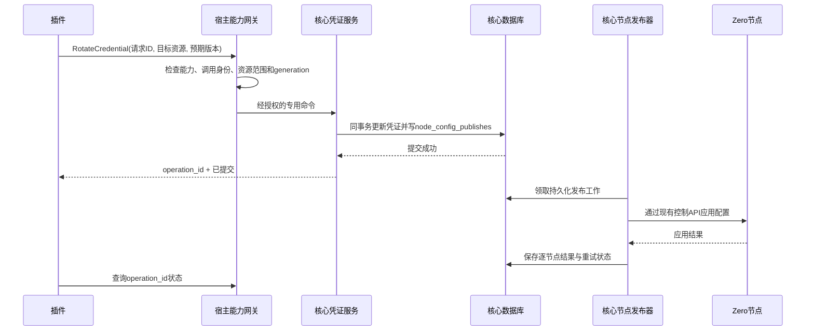

# ZBoard 动态插件系统

状态：`feature/plugin` 实现 A 段——签名包、插件市场、管理、离线导入、前后台页面、配置运行时及专用身份提供方登录。当前还提供宿主管理的包准入、加密 JSON 私有存储和声明式配置/数据迁移，见 [宿主生命周期与数据](plugin-governance.md)。支付、凭证轮换、事件订阅、任务与关系表扩展属于后续能力，当前安装器拒绝声明这些能力的包。使用方法和准确的包格式见 [插件开发与运维](plugins.md)。

## 核心所有权

核心独占用户、凭证、订单、权益、流量和节点配置发布。插件负责扩展交互及外围集成，通过宿主明确开放、版本化的能力提出请求。插件 SDK 不提供数据库连接、GORM、任意 SQL、任意核心命令、管理员令牌、节点控制地址或节点凭证。

`surface` 表示页面所在位置，不授予权限；声明后台页面不意味着插件能访问后台业务。页面位置不授予权限；有效能力取当前包声明、宿主准入、调用身份和核心策略的交集。插件生命周期与核心事务相互独立：停用或卸载插件不撤销已经提交的核心工作，不改变用户、订单、订阅或节点状态。

当前 RPC 包含插件身份、健康检查、配置验证、配置应用、已保存配置测试，以及专用身份提供方元数据/身份验证。登录状态、绑定与会话由核心实现，详见 [身份提供方契约](plugin-identity.md)。浏览器桥只有最小页面上下文及管理员配置能力。新增扩展点必须先在核心服务内定义命令、鉴权、资源范围、幂等和结果语义，再增加独立能力协议与验证用例。

## 参考 Sub2API 的取舍

参考提交 `270eac6973049fe1b50eb75560a74a029e82884c` 的签名包、go-plugin/gRPC、版本要求、配置页面桥及配置应用机制；ZBoard 使用自己的 `.zbplugin`、协议和贡献声明，不兼容 `.s2plugin`。

- 使用独立服务进程、gRPC、握手及运行身份核验；纯页面插件无需进程。
- 包以 Ed25519 签名完整原始 manifest，manifest 用 SHA-256 绑定文件内容。
- 宿主兼容范围、发布者测试版本、协议版本分别校验；未声明测试的兼容版本启用时需管理员确认。
- 升级由宿主准备候选数据和进程，在同一事务内切换版本、配置、数据和准入；成功保留原启停状态，失败保留旧实例与数据。保留最多 30 个版本的记录；恢复旧版本需校验数据和已有配置，不自动向下迁移。
- 配置先验证和应用，再加密提交；持久化失败恢复旧配置，恢复失败终止进程并标记异常。重启以数据库已提交配置为准。
- 首版一个活动宿主，由数据库租约和 epoch 限制，不宣称多实例协调已经完成。

独立进程用于故障隔离，并不是不可信原生代码的 OS 沙箱。签名只证明来源与完整性，不证明代码安全。服务组件必须来自运营者信任并审查的发布者；启动不继承宿主环境、使用独立工作目录和加密 RPC，但当前没有 UID、文件系统、网络或 CPU/RSS 的强制沙箱。运行任意第三方不可信二进制不在本期能力内。

## 交付和动态生命周期

同一包可包含 `public`（公开前台）、`account`（用户前台）、`admin`（管理后台）入口及可选多平台服务二进制。管理系统展示来源、范围、运行组件、兼容性、当前版本、错误和操作记录。

安装路径统一为：市场下载或离线上传 → 包大小/路径检查 → 发布者签名 → manifest 与能力白名单 → 文件摘要 → 私有目录原子保存 → 候选配置/数据迁移与运行时准备 → 安装、准入、数据和迁移记录原子提交。首次安装默认停用；已有配置或数据迁移需要候选原生进程校验时，宿主会启动它，失败则保留旧安装。不兼容包拒绝安装。

启用验证完整包及当前平台，启动可选进程、核验身份、应用配置后提交活动状态，随后页面目录可见。停用先关闭活动状态并递增 generation，撤销页面会话，再终止进程；管理器串行化正在执行的配置操作。当前没有业务 RPC，因此没有在途付款或任务可排空。未来业务能力需独立实现 drain 和超时，不能把配置操作串行化当作业务排空。

卸载由宿主停止运行并撤销会话，删除所有保留版本的程序/页面，保留安装墓碑、加密配置、私有数据与操作记录。单独删除配置不清理核心事实。重新导入同 ID 必须仍为相同签名发布者。

## 市场与离线导入

市场来自部署配置指定的签名目录，不允许从浏览器提交任意下载地址。目录具备有效期，发布者和目录签名均使用运营者配置的可信公钥；安装重新获取目录并比对用户选择的摘要，然后校验下载包的摘要、签名、ID、版本及发布者。

下载仅允许公开 HTTPS 的 443 端口，禁用重定向和环境代理，DNS 解析后检查全部地址并固定连接已检查 IP。未配置市场显示配置提示；离线导入无需网络，使用完全相同的包校验链。首版没有预置或虚构公共市场，也不提供自动更新、评分和开发者上架后台。

## UI 边界

路由在宿主编译时固定，插件只贡献页面描述；导航从活动页面目录刷新。各 surface 由宿主鉴权。插件 HTML 在 `sandbox="allow-scripts"` 的 iframe 内运行，不授予同源、弹窗、表单、顶层导航能力。

宿主签发十分钟资源会话，绑定插件、页面、surface、用途、用户和 generation。资源 token 只读取该插件签名包内 UI 文件，不暴露二进制、manifest、源码映射或其他包。CSP 禁止网络请求、表单和子 frame；不向 iframe 传递宿主登录令牌。HTTP 会话撤销、停用、版本变化、宿主重启均使旧资源失效。

postMessage 校验发送窗口、桥令牌、请求 ID、操作白名单和消息大小。管理员配置页面才可调用 config.load/save/test；普通业务页面只能取得 plugin_id/page_id/surface。宿主卸载容器时撤销会话并取消请求，旧 generation 响应不进入新页面。导航和 iframe 会话每 15 秒可见时刷新，停用后的后端访问立即拒绝，已经绘制的页面在下一次检查时移除。

## 配置和故障恢复

配置为最长 64 KiB 的 JSON 对象，整份使用既有 CredentialCipher 加密；管理 API 返回是否配置、revision 以及可选的插件公开配置投影，不回显秘密值。当前使用 JSON 编辑器或插件自带配置页，不声称已实现 JSON Schema 表单生成。服务插件不能在 ApplyConfig 或 TestConfig 内执行扣款等业务副作用。

配置持久化使用 revision CAS，生命周期使用 generation；宿主租约检查以事务中的 epoch 为准。配置应用成功后 DB 提交失败会重新应用原配置；宿主崩溃后所有进程重新从已提交配置恢复。运行中操作记录在重启时标记 interrupted。进程异常只标记对应插件 failed 并撤销其会话，不把未确认业务结果标成成功。

插件目录、数据库和凭证加密密钥必须一起备份；密钥变更需复用核心密钥迁移流程。SQL 迁移通过新增 `0002_plugins` 建表，MySQL/SQLite 均有明确脚本，不修改已发布的核心 baseline。卸载某个插件不回滚全局 schema。

## 凭证轮换能力的后续接入路径

以后需要“插件动态修改用户凭证并通知节点”时，路径固定如下，当前版本尚未开放此能力：

“数据库已提交”“节点已应用”“旧会话已终止”必须分开表达。节点失败由核心发布器重试，部分节点成功需显示部分完成。轮换是否终止已有连接由核心命令明确决定，不能从配置更新推断。插件停用后核心发布继续执行；插件不能拼装节点配置、直接发节点命令或自行改写发布记录。

## 后续独立能力

身份提供方已经通过专用契约落地。后续支付能力仍需独立设计：插件负责提供方通信及回调验签，核心拥有订单金额/币种、支付 attempt、幂等确认和权益发放。回调成功 ACK 必须在宿主持久化确认后产生；重复、乱序、结果未知和停用中回调均需要独立验收。

事件、定时任务和插件数据 API 后续分别定义。核心事件用事务 Outbox、至少一次投递及幂等，不允许可选插件执行拖住核心事务；任务使用持久化触发标识和租约；插件自有存储由宿主按 plugin_id 隔离，不开放 SQL。灰度、业务 drain、多活动宿主、硬资源限制和不可信代码沙箱都不得由当前健康检查推导为已实现。

第三方登录与注册、多提供方快捷配置、自定义 OAuth2 字段映射和配置密钥保留契约见 [插件身份能力](plugin-identity.md)。配置读取可包含插件投影的公开字段；密钥保持隐藏。
